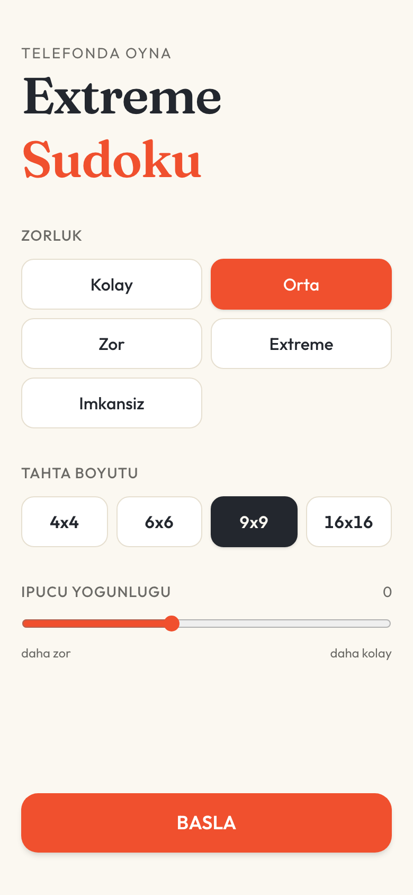
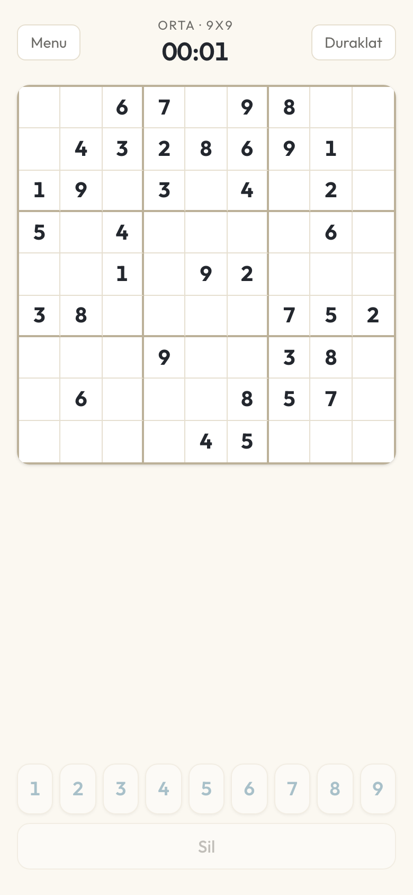

# 🧩 Extreme Sudoku

Mobil-öncelikli, modern bir web Sudoku oyunu — **4×4'ten 16×16'ya** kadar tahta boyutları, insan tekniklerine dayalı akıllı ipuçları ve _İmkânsız_ seviyeye kadar 5 farklı zorluk. Tamamen TypeScript ile yazılmış, tek çözüm garantili bir motor üzerinde çalışır.



---

## ✨ Özellikler

### 🎮 Oyun
- **4 tahta boyutu:** 4×4, 6×6, 9×9, 16×16
- **5 zorluk seviyesi:** Kolay · Orta · Zor · Extreme · İmkânsız
- **İpucu yoğunluğu ayarı** — başlangıçta açık hücre sayısını kontrol et
- **Günlük bulmaca** — deterministik seed sayesinde herkese aynı bulmaca

### 🧠 Yardımcılar
- **Akıllı ipucu** — insan çözüm teknikleriyle: Tek Aday, Gizli Tek, Çıplak İkili, X-Kanat ve daha fazlası
- **Not modu** — hücrelere aday rakam notları al
- **Hata gösterme** — yanlış girişleri anında işaretle
- **Aynı rakam vurgulama** — seçili rakamı tüm tahtada öne çıkar
- **Geri al** & **Duraklat**

### 📊 Deneyim
- **Yerel skorboard** — `localStorage` üzerinde en iyi süreler
- **Konfeti tamamlama efekti** 🎉
- **Haptik titreşim** — dokunsal geri bildirim
- **Açık / Koyu tema**



---

## 🛠️ Teknoloji Yığını

| Katman | Teknoloji |
|--------|-----------|
| Framework | **Next.js 16** (App Router) |
| UI | **React 19** |
| Dil | **TypeScript 5** |
| Stil | **Tailwind CSS v4** |
| Efekt | **canvas-confetti** |
| Test | **Vitest** (110+ test) |
| Dağıtım | **Vercel** |

---

## 🚀 Kurulum & Çalıştırma

```bash
# Bağımlılıkları yükle
npm install

# Geliştirme sunucusu (http://localhost:3000)
npm run dev

# Üretim derlemesi
npm run build

# Testleri çalıştır
npm test
```

---

## 📁 Proje Yapısı

```
sudodu/
├── app/              # Next.js App Router (sayfalar, layout, ikonlar)
├── components/       # React arayüz bileşenleri (BoardView, NumberPad, Toolbar…)
└── lib/
    ├── engine/       # Saf TypeScript Sudoku motoru (üretici, çözücü, ipucu)
    └── game/         # Oyun durumu, skorboard, haptik, semboller
```

---

## ⚙️ Oyun Motoru

`lib/engine`, herhangi bir UI'a bağımlı olmayan **saf TypeScript** bir motordur:

- **Boyut-agnostik** — aynı kod 4×4'ten 16×16'ya kadar tüm tahtaları üretir ve çözer.
- **Tek çözüm garantili** — her bulmacanın yalnızca bir geçerli çözümü olduğu doğrulanır.
- **Teknik-tabanlı zorluk** — zorluk, gereken çözüm tekniklerinin karmaşıklığına göre ölçülür; tahmine değil mantığa dayanır.
- **Deterministik** — seed tabanlı RNG, tekrarlanabilir bulmacalar (günlük bulmaca) sağlar.

---

## ☁️ Vercel'e Dağıtım

1. Projeyi bir **GitHub** deposuna gönder (`git push`).
2. [vercel.com](https://vercel.com) üzerinden depoyu **Import** et.
3. Vercel, Next.js'i otomatik algılar — ek yapılandırma gerekmez. 🚀

---

## 📄 Lisans

[MIT](LICENSE) lisansı altında dağıtılır.
